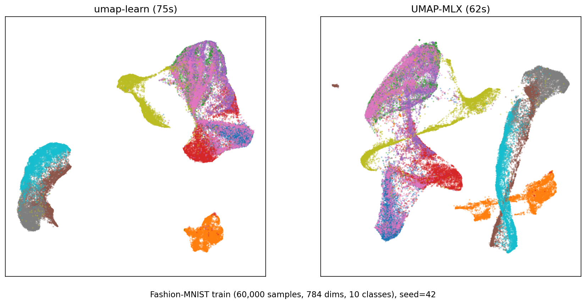

# umap-mlx

UMAP in pure MLX for Apple Silicon. Entire pipeline runs on Metal GPU.

10-20x faster than umap-learn on small-to-medium datasets. Competitive on 60K.

## Install

```bash
git clone https://github.com/hanxiao/umap-mlx.git && cd umap-mlx
uv venv .venv && source .venv/bin/activate
uv pip install -e .
```

## Usage

```python
from umap_mlx import UMAP
import numpy as np

X = np.random.randn(1000, 128).astype(np.float32)
Y = UMAP(n_components=2, n_neighbors=15).fit_transform(X)
```

Parameters:

- `n_components`: output dimensions (default 2)
- `n_neighbors`: k for k-NN graph (default 15)
- `min_dist`: minimum distance in low-dim space (default 0.1)
- `spread`: scale of embedded points (default 1.0)
- `n_epochs`: optimization epochs (default 200)
- `learning_rate`: SGD learning rate (default 1.0)
- `random_state`: seed for reproducibility
- `verbose`: print progress

## Performance (M3 Ultra, Fashion-MNIST)

```
N       umap-learn    MLX      speedup
1000    4.88s         0.24s    20.5x
5000    17.19s        0.90s    19.1x
10000   26.02s        2.45s    10.6x
60000   75s           62s      1.2x
```

## Comparison

Fashion-MNIST train (60,000 samples, 784 dims, 10 classes):



Fashion-MNIST created by Han Xiao et al. (11,000+ citations).

## How it works

1. k-NN via exact pairwise distances on Metal GPU
2. Fuzzy simplicial set with binary search for per-point sigma
3. Edge pruning: remove weights < max/n_epochs (matches umap-learn)
4. SGD on Metal GPU using `mx.array.at[].add()` for scatter accumulation
5. Negative sampling with repulsive forces

Dependencies: `mlx`, `numpy` only. No scipy, no PyTorch.

## License

MIT
